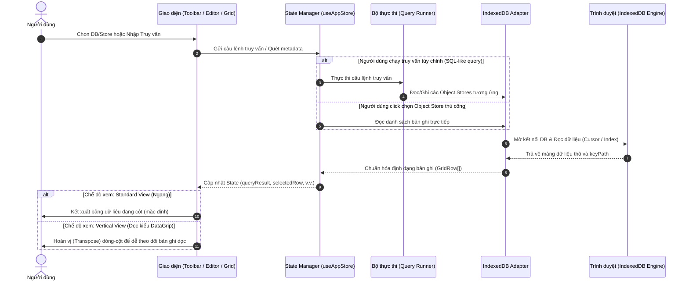
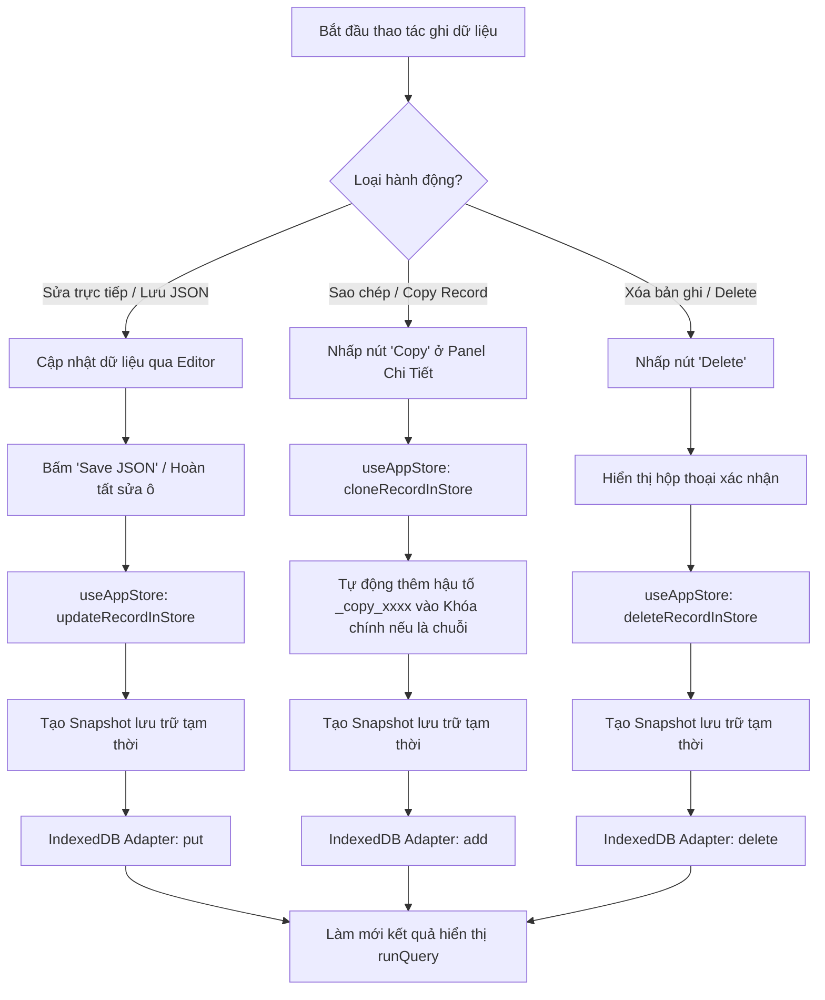
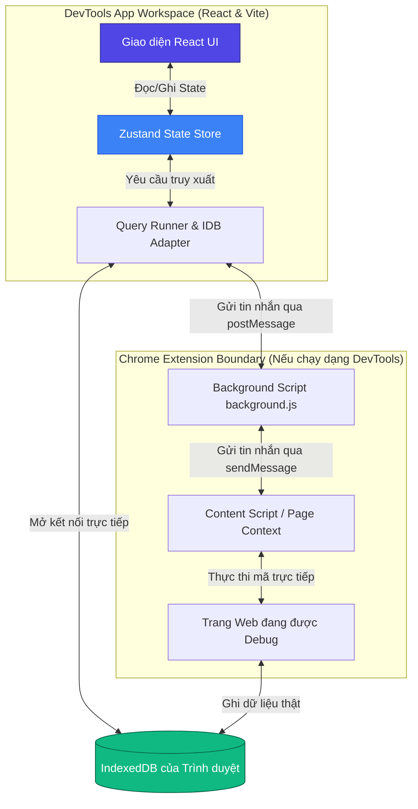

# IndexedDB Studio - Luồng Hoạt Động & Hướng Dẫn Triển Khai

Tài liệu này mô tả chi tiết kiến trúc, luồng hoạt động (Operation Flow) và cách thức triển khai của ứng dụng **IndexedDB Studio**. 

---

## 1. Luồng Hoạt Động (Operation Flows)

Dưới đây là các sơ đồ Mermaid thể hiện chi tiết luồng xử lý dữ liệu và tương tác của người dùng trong hệ thống.

### A. Luồng truy vấn và hiển thị dữ liệu (Query & View Flow)
Sơ đồ này mô tả cách hệ thống tiếp nhận yêu cầu từ người dùng, quét cấu trúc hoặc thực hiện truy vấn và kết xuất kết quả hiển thị lên giao diện (hỗ trợ cả hai chế độ: **Standard Grid** truyền thống và **Vertical Table View** kiểu DataGrip).



---

### B. Luồng cập nhật, sao chép và xóa bản ghi (Write & Mutation Flow)
Sơ đồ mô tả quy trình khi người dùng cập nhật ô trực tiếp, lưu chỉnh sửa JSON thô, thực hiện nhân bản (Clone/Copy) hoặc xóa bản ghi trong cơ sở dữ liệu IndexedDB.



---

## 2. Kiến Trúc Hệ Thống (System Architecture)

IndexedDB Studio được thiết kế để có thể vận hành linh hoạt dưới cả hai dạng: **Ứng dụng Web độc lập (WebApp)** chạy trong sandbox của trình duyệt và **Tiện ích mở rộng Chrome DevTools (Chrome Extension)**.



### Các thành phần chính trong mã nguồn:
- **`src/panel/store/useAppStore.ts`**: Đóng vai trò là trung tâm quản lý trạng thái (Zustand), điều phối mọi hành động từ việc chuyển đổi bố cục giao diện, thực thi câu lệnh cho đến cập nhật và sao chép bản ghi.
- **`src/shared/indexeddb-adapter.ts`**: Lớp trừu tượng hóa trực tiếp giao tiếp với IndexedDB của trình duyệt, cung cấp các hàm `add`, `put`, `delete`, quét cơ sở dữ liệu và lấy metadata của các Object Store.
- **`src/shared/query-runner.ts` & `query-parser.ts`**: Biên dịch các câu lệnh SQL-like tùy chỉnh thành các hành động điều hướng Cursor, Index Lookup, Filter phù hợp với kiến trúc NoSQL của IndexedDB.
- **`src/panel/components/ResultGrid.tsx`**: Thành phần hiển thị kết quả truy vấn, tích hợp tính năng hoán vị bảng thành dạng dọc (**Vertical Table View**) giúp người dùng dễ dàng đối chiếu, so sánh các bản ghi có nhiều cột dữ liệu.

---

## 3. Cách Thức Triển Khai (Deployment Guide)

### Bước 1: Cài đặt các gói phụ thuộc
Sử dụng npm để cài đặt đầy đủ các thư viện cần thiết cho việc biên dịch và kiểm thử:
```bash
npm install
```

### Bước 2: Khởi chạy môi trường phát triển (Development)
Chạy server phát triển cục bộ với tính năng cập nhật mã nguồn tức thì:
```bash
npm run dev
```
*Hệ thống sẽ khởi chạy server tại địa chỉ `http://localhost:3000` (hoặc cổng được cấu hình mặc định).*

### Bước 3: Biên dịch sản phẩm (Production Build)
Để tối ưu hóa mã nguồn, đóng gói tài nguyên tĩnh phục vụ cho việc deploy hoặc tích hợp vào tiện ích Chrome Extension:
```bash
npm run build
```
Sau khi tiến trình hoàn tất, các tệp tin phân phối tĩnh sẽ được lưu trữ trong thư mục `/dist`.

### Bước 4: Tích hợp vào Chrome Extension (Nếu cần)
1. Truy cập vào đường dẫn `chrome://extensions/` trên trình duyệt Chrome.
2. Bật chế độ nhà phát triển (**Developer mode**).
3. Chọn mục **Load unpacked** (Tải thư mục đã giải nén).
4. Tìm và chọn thư mục gốc của dự án (nơi có chứa tệp tin `manifest.json` và thư mục `/dist` sau khi build).
